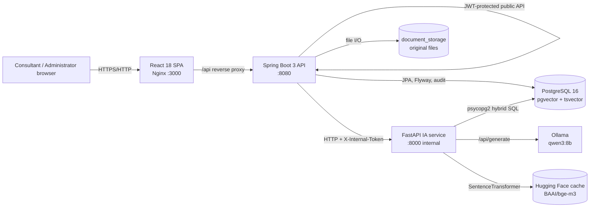
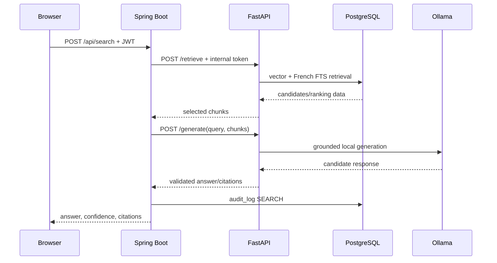
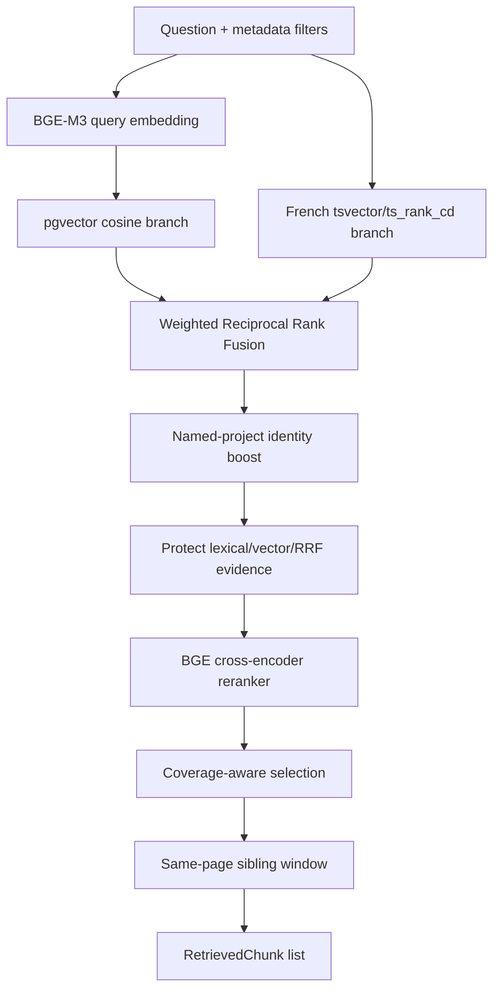
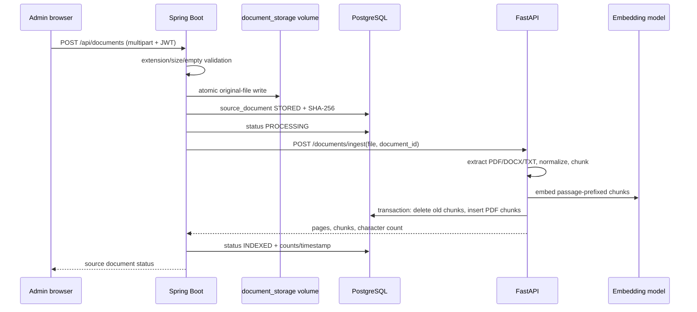
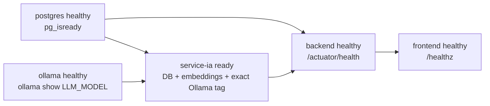
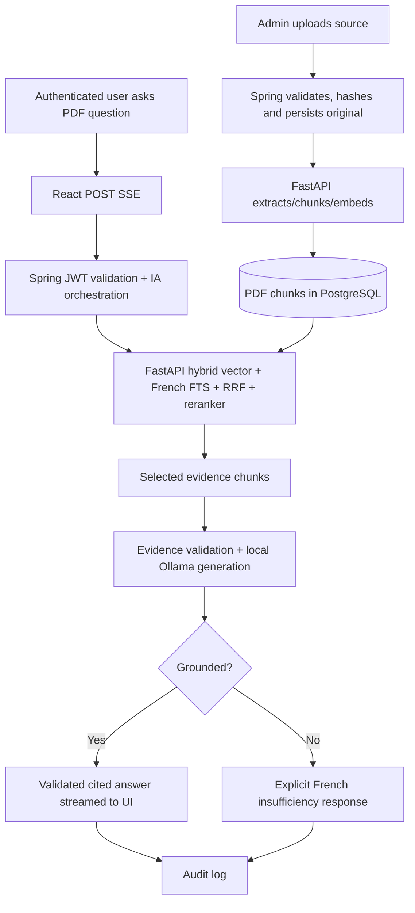

# Avaliance Copilot — Architecture Overview

> **Purpose.** This document describes the architecture that is implemented in this repository as of 2026-08-11. It is intended to let a new developer understand the product, its trust boundaries, execution paths, data model, deployment model, and operational constraints without reverse-engineering the code first.

## 1. System at a glance

Avaliance Copilot is a self-hosted, French-language Retrieval-Augmented Generation (RAG) platform for an ESN/consulting context. It turns internal mission knowledge and administratively uploaded documents into two assisted-production capabilities:

1. **Grounded question answering:** a consultant asks a business question and receives a French Markdown answer backed by retrieved document excerpts, citations, pages, and a confidence value.
2. **Proposal support:** a consultant describes a new need, receives similar synthetic missions, and obtains an RFP/proposal structure.

It is deliberately **not a general-purpose chatbot**. Its design prioritizes controlled documents, source traceability, explicit abstention when evidence is inadequate, and local processing. The generation model runs through self-hosted Ollama; the product execution path does not call a third-party LLM API.

### Architectural principles

- **Frontend speaks only to Spring Boot.** React never addresses FastAPI, PostgreSQL, or Ollama directly.
- **Spring Boot is the public boundary.** It owns JWT authentication, role authorization, document lifecycle, public REST/SSE APIs, audit records, and orchestration.
- **FastAPI is internal and stateless.** It authenticates every call with `X-Internal-Token`, performs extraction, embeddings, hybrid retrieval, reranking, grounded generation, and similar-mission scoring.
- **PostgreSQL is the knowledge-system source of truth.** It stores user/account data, audit data, mission metadata, chunks, embeddings, full-text indexes, and source-document metadata.
- **Original uploaded files are separate from indexed text.** They persist in a Docker named volume mounted only into the backend; PostgreSQL records the link and provenance.
- **PDF is the public search default.** The public search API and React search page explicitly use `PDF` scope. Synthetic mission content remains available for mission browsing and similar-mission/RFP workflows.
- **Evidence before answer.** Retrieval precedes generation; generated factual answers are validated against exact source quotes and citation provenance.

### Runtime topology



The Docker bridge network is `avaliance-internal`. Only frontend port `3000` and backend port `8080` are published by Compose. PostgreSQL (`5432`), FastAPI (`8000`), and Ollama (`11434`) are intended to remain private.

---

## 2. Repository map

| Path | Responsibility |
|---|---|
| `frontend/` | React/Vite TypeScript application; Nginx production runtime; Playwright browser tests. |
| `backend/` | Spring Boot 3.3.7 / Java 17 public API, security, document lifecycle, Flyway schema owner, audit and IA orchestration. |
| `service-ia/` | FastAPI/Python 3.11 internal AI service: ingestion, embeddings, retrieval, reranking, evidence validation, Ollama calls, SSE. |
| `db/init/` | Fresh-database prerequisite only: enables PostgreSQL `vector` extension. |
| `data/` | Deterministic, fully synthetic mission corpus generator and generated corpus. |
| `ml/` | Embedding-training dataset, fine-tuned SentenceTransformer artifact, pair-generation and evaluation tools. |
| `scripts/` | Corpus loading/seeding, golden/evaluation tools, retrieval tracing, live parity reporting, model benchmarking. |
| `benchmarks/` | Versioned golden cases and evaluation outputs; not runtime training data. |
| `docker-compose.yml` | Five-service topology, volumes, networks, health checks and runtime configuration. |
| `docker-compose.gpu.yml` | GPU override file; currently repeats GPU directives already present in the base Compose file. |
| `.env.example` | Full configuration template; copy to `.env` and replace secrets before startup. |
| `DEPLOYMENT.md`, `runner.md`, `Makefile` | Deployment and developer-operation guidance. |

---

## 3. Component breakdown

## 3.1 Frontend — React 18, TypeScript, Vite, Nginx

### Role

The frontend is a browser SPA for authentication, search, RFP generation, mission browsing, dashboarding, and administrator-only document/user management. It is a presentation and public-API client only; it has no direct database, AI-service, or Ollama access.

### Technology and build

- React 18 + TypeScript with strict compiler settings.
- Vite development server; `vite.config.ts` proxies `/api` to `http://localhost:8080`.
- React Router v6 with `BrowserRouter`.
- TanStack React Query v5 for server state; queries retry once and are fresh for 30 seconds.
- `react-markdown` renders answer and RFP Markdown.
- Motion, Lucide and visual utility libraries support the interface.
- Production image: Node 22 build stage, then Nginx 1.27 Alpine on port `3000` (`frontend/Dockerfile`).
- Production Nginx configuration in `frontend/nginx.conf` serves the SPA, proxies `/api/` to `backend:8080`, disables buffering/cache for streams, caps uploads at `21m`, and provides `GET /healthz`.

### Entry and route protection

`frontend/src/main.tsx` builds the provider hierarchy:

```text
React.StrictMode
└── QueryClientProvider
    └── BrowserRouter
        └── AuthProvider
            └── App
```

`frontend/src/App.tsx` exposes these routes:

| Route | Page | Access |
|---|---|---|
| `/login` | Login | Public |
| `/tableau-de-bord` | Dashboard | Authenticated |
| `/recherche` | RAG Search | Authenticated |
| `/propositions` | RFP generator | Authenticated |
| `/missions` | Mission directory | Authenticated |
| `/missions/:missionId` | Mission detail | Authenticated |
| `/documents` | Document administration | `ADMIN` only |
| `/utilisateurs` | User administration | `ADMIN` only |

`ProtectedRoute` redirects anonymous users to login; `AdminRoute` redirects authenticated non-admins to search. `AppShell` provides desktop/mobile navigation, the role-sensitive menu, logout, and a local quick-navigation palette.

### Browser authentication model

`AuthContext` stores `{ token, username, role }` in `localStorage` under `avaliance-copilot-session`. Every authenticated request adds:

```http
Authorization: Bearer <JWT>
```

On a `401` or `403`, `src/api/client.ts` clears that stored session and dispatches `avaliance:session-expired`; `AuthProvider` clears React Query state and makes the app anonymous. This is a token-in-local-storage implementation, not an HttpOnly-cookie implementation.

### Browser API boundary

`frontend/src/api/client.ts` is the sole browser-to-server abstraction. Its base URL is `VITE_API_BASE_URL`, defaulting to `/api`. It uses JSON for ordinary requests, lets the browser set multipart boundaries for uploads, and uses blobs for original-document downloads.

| Browser method | Spring endpoint | Primary UI |
|---|---|---|
| `login` | `POST /api/auth/login` | Login |
| `users`, `registerUser` | `GET /api/auth/users`, `POST /api/auth/register` | Users |
| `dashboard` | `GET /api/dashboard/summary` | Dashboard |
| `missions`, `mission` | `GET /api/missions`, `GET /api/missions/{id}` | Missions |
| `searchStream` | `POST /api/search/stream` | Search |
| `search` | `POST /api/search` | Defined for non-streaming use; current search page streams |
| `generateRfp` | `POST /api/rfp/generate` | Proposals |
| Document operations | `/api/documents...` | Documents and citation preview |

### Search UX and real SSE consumption

`SearchPage.tsx` is the main RAG user interface. It defaults to `topK: 15` and lets the user choose 5, 10, or 15 sources, sends a fresh `crypto.randomUUID()` request ID, optional sector/type/year filters, and hard-coded `corpusScope: 'PDF'`.

It does not use `EventSource`, because the request requires a JWT header and a JSON POST body. Instead, `searchStream()` uses `fetch` plus a manual `ReadableStream` SSE parser. This supports POST, authentication, cancellation through `AbortController`, custom named events, and timing metrics.

Expected event handling:

| Event | UI action |
|---|---|
| `status: retrieving` | Display retrieval progress. |
| `status: generating` | Display generation progress. |
| `delta` | Append a token fragment to the draft answer. |
| `citation` | Add/de-duplicate a citation card. |
| `evidence` | Supported by client callback; currently not rendered by SearchPage. |
| `validation` with `passed: false` | Fail the trusted-answer flow. |
| `done` | Finalize answer, citations, confidence and timings. |
| `error` | Enter error state. |

Token updates are buffered to `requestAnimationFrame` rather than causing one React render per token. The page exposes stream first-byte, first-rendered-token, and total-time metrics as `window.__avalianceStreamMetrics` for Playwright verification.

Answers matching French insufficient-evidence phrases such as *information insuffisante* are rendered as a dedicated abstention state rather than as a normal synthesis. The frontend does not decide evidence quality itself; it reflects the backend/IA result.

### Citations and source preview

The response citation type preserves chunk, document, page, mission, corpus-scope and scoring metadata. Search renders Markdown, normalizes citation markers, and replaces `[n]` markers with clickable citation controls. Source cards display the selected chunk content and page where present.

For document-backed citations, the UI can request `GET /api/documents/{id}/content`, create a Blob URL, and render the original in an iframe at the cited page. The backend makes this endpoint `ADMIN` only. Consequently, consultants may see a source card but can receive an authorization error when attempting the underlying original-file preview; the page handles this as a preview load failure.

### Other frontend execution flows

- **Login:** validates fields, prevents duplicate submissions, calls login, stores session and redirects to the requested protected page or dashboard.
- **Dashboard:** refreshes `GET /api/dashboard/summary?days=30` every 60 seconds and renders activity, response-duration and mission aggregates.
- **Mission directory:** paginates/filter missions by sector, type and year; detail displays stored mission metadata.
- **RFP page:** submits description plus optional filters and `topK: 5`; displays returned similar missions and Markdown `rfpStructure`, with copy/download support.
- **Documents page:** admin validates `.pdf`, `.docx`, `.txt`, non-zero size, and 20 MiB max client-side; uploads a multipart file, follows lifecycle status, retries failures, downloads originals and deletes records.
- **Users page:** admin lists accounts and registers `ADMIN`/`CONSULTANT` users; server-side authorization remains authoritative.

### Frontend tests

Playwright tests under `frontend/e2e/` cover login behavior, a complete P3 RAG flow, evidence/citation display, abstention, RFP generation, and a focused PDF-only Novacom streaming scenario. The streaming test verifies the POST SSE path, evidence page 13, source uniqueness, PDF scope, and timing artifacts. Vite development normally runs at `127.0.0.1:5173`; the containerized frontend is `3000`.

---

## 3.2 Backend — Spring Boot public API and orchestration layer

### Role

The backend is the public, authenticated application service. It is the authoritative entry point for clients and owns:

- JWT login and role-based authorization;
- application-level validation and consistent public errors;
- mission, dashboard and user APIs;
- original-file storage and document lifecycle;
- Flyway migrations and JPA schema validation;
- calls to FastAPI using the internal-token trust boundary;
- audit logging of search, similar-mission and RFP activity;
- proxying/cancellation-compatible SSE flows.

### Runtime

- Java 17, Spring Boot 3.3.7, Maven (`backend/pom.xml`).
- Entrypoint: `CopilotApplication.java`.
- Spring MVC supplies REST controllers; WebFlux/WebClient is used for streaming proxy behavior.
- JPA handles mapped application metadata; Hibernate is configured `ddl-auto: validate`, never schema generation.
- Flyway applies `backend/src/main/resources/db/migration/*` on startup.
- Actuator exposes health/info; Springdoc exposes `/v3/api-docs` and `/swagger-ui.html`.
- Container: multi-stage Maven build, Java 17 Alpine runtime, non-root `appuser`, port `8080` (`backend/Dockerfile`).

`application.yml` configures upload limits of 20 MB file / 21 MB request, database connectivity, IA timeouts, CORS, JWT, bootstrap administrator and `/data/documents` storage path.

### Public API

| Endpoint | Authorization | Responsibility |
|---|---|---|
| `POST /api/auth/login` | Public | Return JWT, username and role. |
| `GET /api/auth/users` | `ADMIN` | List users. |
| `POST /api/auth/register` | `ADMIN` | Create user and role. |
| `GET /api/missions` | Authenticated | Paginated/filterable missions. |
| `GET /api/missions/{id}` | Authenticated | One mission. |
| `POST /api/search` | Authenticated | Synchronous retrieve then grounded generation. |
| `POST /api/search/stream` | Authenticated | SSE retrieve/generate orchestration. |
| `POST /api/similar` | Authenticated | Similar synthetic missions. |
| `POST /api/rfp/generate` | Authenticated | Similar missions, then RFP structure. |
| `GET /api/dashboard/summary` | Authenticated | Metrics derived from mission/user/audit data. |
| `POST /api/documents` | `ADMIN` | Store and synchronously start indexing a file. |
| `GET /api/documents` | `ADMIN` | Paginated document registry. |
| `GET /api/documents/{id}/content` | `ADMIN` | Authenticated original download. |
| `POST /api/documents/{id}/index` | `ADMIN` | Retry indexing a failed document. |
| `DELETE /api/documents/{id}` | `ADMIN` | Delete original, metadata and cascading chunks. |

The search request accepts a query, filters, `topK`, correlation `requestId`, and scope. The public backend validates that scope is either absent or `PDF`, preventing callers from using the internal `MISSION` and `LEGACY_SYNTHETIC` scopes through the public RAG endpoint.

### Security model

1. The login service verifies a BCrypt password hash.
2. `JwtService` creates/validates HS256 tokens with username as subject and `role` claim.
3. `JwtAuthenticationFilter` reads `Authorization: Bearer ...` and places `ROLE_ADMIN` or `ROLE_CONSULTANT` into Spring Security context.
4. Security is stateless and CSRF is disabled.
5. Method-level guards protect sensitive user/document operations even though `/api/auth/**` is broadly URL-permitted.
6. `AdminSeeder` creates or synchronizes the configured bootstrap administrator at startup.
7. CORS applies to `/api/**` and uses the configured frontend origin allow-list.

Required secrets are injected through environment variables, especially `JWT_SECRET`, `ADMIN_PASSWORD` and `INTERNAL_TOKEN`. The template says the JWT secret must be at least 64 characters.

### Error model

`GlobalExceptionHandler` returns a normalized body containing `status`, `error`, `message`, and ISO-8601 `timestamp`. Important mappings include validation (`400`), bad credentials (`401`), forbidden (`403`), missing entity (`404`), over-large upload (`413`), unsupported file (`415`), IA unavailable/timeout (`503`), other IA client failures (`502`), storage/unexpected errors (`500`).

### Backend-to-IA boundary

`IaClientService` is the sole FastAPI client. It uses `RestClient` for ordinary calls and `WebClient` for SSE, configured by `RestClientConfig`. Each request sets the shared `X-Internal-Token` header.

Supported internal calls are `/health`, `/retrieve`, `/generate`, `/generate/stream`, `/similar`, `/rfp`, and multipart `/documents/ingest`. `IA_STUB_ENABLED=true` substitutes a limited test/development stub for retrieval/generation/similar/RFP; it cannot index documents.

### Search orchestration

For synchronous search:



For streaming search, Spring emits `status: retrieving`, performs retrieval on bounded-elastic scheduling, emits `status: generating`, and forwards FastAPI SSE events. It preserves recognized upstream event names or maps generic payloads into `delta`, `citation`, `evidence`, `validation`, `done`, `error`, or `heartbeat`. Response headers disable transformation/buffering: `Cache-Control: no-cache, no-transform` and `X-Accel-Buffering: no`.

### Similar-mission and RFP orchestration

- `/api/similar` maps the public camelCase request to the FastAPI contract and records audit data.
- `/api/rfp/generate` first calls `/similar`, then sends the input description and returned similar missions to FastAPI `/rfp`.
- Audit records include action, invoking user where resolvable, request text, result status and elapsed duration.

### Document lifecycle owned by Spring Boot

The backend controls original file handling. Its ingestion sequence is:

1. An admin submits `multipart/form-data` to `POST /api/documents`.
2. The backend permits only `.pdf`, `.docx`, `.txt`, rejects an empty file, sanitizes/bounds the display filename, and selects a random UUID-based storage key.
3. `DocumentStorageService` writes through a temporary file and atomic move under `DOCUMENT_STORAGE_PATH`; it computes SHA-256.
4. It persists a `source_document` row in `STORED` state, then marks it `PROCESSING`.
5. It sends the stored file bytes and `document_id` to FastAPI `/documents/ingest`.
6. On success, it saves page count, chunk count, timestamp, and `INDEXED` state.
7. On downstream indexing failure, it retains the original, bounds/stores the error message, and marks the record `FAILED`; retry remains possible.
8. Reindexing reads the original and repeats the same IA process.
9. Deletion removes the original then deletes the source record; the database foreign key cascades to chunks.

The backend is therefore the owner of user authorization, originals and lifecycle state. FastAPI owns textual extraction/chunk replacement only.

### Backend tests

JUnit coverage includes authentication, bootstrap admin synchronization, dashboard aggregation, storage validation, document service/controller access rules, IA client mapping, synchronous/streaming search behavior, Flyway schema, audit persistence, and real pgvector Testcontainers integration. Failsafe runs `*IT.java` on Maven `verify`.

---

## 3.3 IA service — FastAPI retrieval, grounding and generation

### Role and deployment boundary

`service-ia` is an internal FastAPI service. It does not maintain user sessions and is not directly exposed by Compose. It accepts only service-to-service calls from Spring Boot or controlled maintenance/evaluation calls on the Docker network.

Every route requires `X-Internal-Token`:

- missing header: `401 Internal token required`;
- wrong secret: `403 Invalid internal token`;
- comparison uses `secrets.compare_digest`.

### Runtime and startup

- FastAPI 0.115.6, Uvicorn, Pydantic v2, psycopg2, NumPy, Sentence Transformers, Docling and python-docx.
- Entrypoint: `service-ia/app/main.py`, `app = create_app()`.
- Container: `pytorch/pytorch:2.6.0-cuda12.4-cudnn9-runtime`, non-root UID 10001, port `8000` (`service-ia/Dockerfile`).
- API documentation endpoints are disabled in the internal service.

At lifespan startup, the service attempts to initialize a `ThreadedConnectionPool` for PostgreSQL and load the configured SentenceTransformer. Failure is logged without terminating the process. Consequently, `/health` indicates process-level state while `/ready` is the meaningful dependency gate: it requires an active pool, loaded embeddings, and an Ollama tag exactly equal to `LLM_MODEL`.

### Internal API surface

| Endpoint | Purpose |
|---|---|
| `GET /health` | Authenticated liveness/status including embedding state. |
| `GET /ready` | Authenticated readiness: DB + embeddings + exact Ollama tag. |
| `POST /embed` | Encode raw text with BGE-M3. |
| `POST /ingest` | Ingest/update synthetic mission corpus. |
| `POST /documents/ingest` | Extract, chunk and atomically replace document chunks. |
| `POST /retrieve` | Hybrid retrieval for scoped corpus. |
| `POST /retrieve/trace` | Retrieval plus internal stage/candidate/timing trace for evaluation. |
| `POST /similar` | Similar synthetic missions. |
| `POST /generate` | Grounded non-streamed answer from supplied chunks. |
| `POST /generate/stream` | Grounded answer SSE. |
| `POST /rfp` | Generate a proposal structure from supplied missions. |

Pydantic models in `service-ia/app/schemas.py` define the interservice contracts.

### Configuration

`service-ia/app/settings.py` binds environment settings. Major groups:

- **Connectivity:** `INTERNAL_TOKEN`, `DATABASE_URL`, `OLLAMA_URL`, `OLLAMA_TIMEOUT_SECONDS`.
- **Models:** `EMBEDDING_MODEL_PATH`, `LLM_MODEL`, `OLLAMA_KEEP_ALIVE`, `OLLAMA_NUM_CTX`.
- **Generation:** `GENERATION_MAX_TOKENS`, `GENERATION_MAX_CONTEXT_CHUNKS`, `GENERATION_CACHE_MAX_ENTRIES`.
- **Contextual retrieval:** opt-in `CONTEXTUAL_RETRIEVAL_ENABLED` plus a bounded `CONTEXTUAL_RETRIEVAL_MAX_TOKENS` (default 120) for retrieval-only chunk-role prefixes.
- **Retrieval:** candidate/rerank limits, RRF constant/weights, HNSW `ef_search` and iterative scan mode, lexical reserve, safeguard and final-chunk bounds.

Pydantic ignores unknown environment keys. In particular, root-template variables `GENERATION_ANSWER_MODE` and `GENERATION_USE_DETERMINISTIC_EXTRACTORS` are passed by Compose but are not current `Settings` fields, so they do not configure runtime behavior. `MIN_SOURCE_SIMILARITY` is a settings field, but no active runtime use was found beyond settings declaration.

### Database access

`app/db.py` owns a psycopg2 `ThreadedConnectionPool` (minimum 2, maximum 10). Its connection context commits successful work and rolls back failures. Queries use `RealDictCursor`, parameterized SQL, batched insertion where appropriate, and transaction-local settings using `set_config`. The local settings prevent one query's HNSW tuning from leaking into a later pooled connection.

### Embedding model

The runtime embedding model is `BAAI/bge-m3`, downloaded from Hugging Face into the named `huggingface_cache` volume. It produces normalized **1024-dimensional** vectors, matching `vector(1024)` in PostgreSQL.

BGE-M3 receives raw indexed chunks, queries and similarity descriptions; the retired model-family `passage:` and `query:` prefixes are not used. Contextual retrieval, when enabled, prepends its generated retrieval-only context without mutating the stored source text.

The embedding singleton requires CUDA and loads `BAAI/bge-m3` with `torch.float16` model weights. It refuses a CPU fallback so a misconfigured production GPU runtime fails readiness rather than silently degrading retrieval latency. This aligns embeddings with the CUDA/FP16-capable reranker and the GPU-enabled Compose deployment.

### Ingestion: controlled source documents

FastAPI document ingestion is implemented under `service-ia/app/ingestion/`.

1. It verifies embeddings are loaded and selects extraction by extension.
2. **PDF:** self-hosted MIT-licensed Docling converts the document with layout/table-aware extraction. It exports text page by page and preserves real 1-based page numbers. Encrypted, scanned, blank, or no-text PDFs fail; OCR is intentionally out of scope.
3. **DOCX:** paragraphs and tables are traversed in document order.
4. **TXT:** UTF-8/BOM is preferred; CP1252 is a fallback.
5. Text is normalized and chunked sentence-first while attempting paragraph boundaries. Document defaults are maximum 1,150 characters, target 850, minimum 250, with 140-character overlap; very long sentences fall back to word segmentation.
6. By default each chunk is embedded as its raw source text. The opt-in `CONTEXTUAL_RETRIEVAL_ENABLED` setting first asks the local model for a bounded 50–100-word retrieval-only description of each chunk's role in its document, then embeds `<contextual prefix>\n\n<original chunk>`. The prefix is not persisted in `doc_chunk.content`, supplied to generation, or eligible for citations; prefix-generation failure safely falls back to the original source chunk. Enabling it requires explicit reindexing and recall evaluation.
7. In one database transaction, old chunks for the `source_document_id` are deleted and replacement rows inserted with null `mission_id`, source page (PDF only), sequential `chunk_index`, and `corpus_scope = 'PDF'`.
8. It returns source id, page count, inserted chunks and extracted character count to Spring Boot.

Atomic delete-and-insert prevents a successfully reindexed document from exposing a mix of old and new chunks.

### Ingestion: synthetic mission corpus

`app/ingestion/pipeline.py` ingests synthetic missions received at `/ingest`.

- Missions are upserted by title.
- Existing mission chunks are deleted before replacements; metadata is updated.
- Mission document bodies are chunked with API defaults 512/64 unless overridden.
- Chunks inherit sector, type, technologies and year, receive raw BGE-M3 embeddings, and are stored with `corpus_scope = 'MISSION'`.

The data generator creates 300 fully synthetic French missions with 900 documents at seed 42 (`data/corpus/manifest.json`). The seeding helper batches input missions and posts to `/ingest`.

### Hybrid retrieval

The implementation in `service-ia/app/retrieval/vector_search.py` is the core RAG retrieval path.



#### Scope and filters

The default retrieve scope is `PDF`.

- `PDF`: requires `doc_chunk.corpus_scope = 'PDF'`, a source-document link, and a source-document state of `INDEXED`.
- `MISSION`: requires `corpus_scope = 'MISSION'` and a mission link.
- `LEGACY_SYNTHETIC`: is retained for compatibility/internal handling.

Exact optional filters are sector, mission type and year. The backend blocks public callers from changing away from `PDF`.

#### Ranking stages

1. The normalized query embedding is cached in an LRU cache.
2. Vector and text searches run concurrently in a two-worker executor.
3. Vector SQL ranks cosine similarity using pgvector `<=>`; it applies local `hnsw.ef_search` and `hnsw.iterative_scan` values.
4. French FTS queries the generated `tsvector` with `to_tsquery('french', ...)` and ranks using `ts_rank_cd`. It may use lexical expansion while retaining original wording.
5. The candidate ranks are merged using weighted reciprocal rank fusion:

   $$\operatorname{RRF}(d) = \sum_i \frac{w_i}{k + \operatorname{rank}_i(d)}$$

   where $k$ defaults to 60 and vector/text weights default to 1.0.
6. Recognizable named projects can receive a small content/filename identity boost (0.15). This affects ordering, not corpus filtering.
7. Strong lexical matches and strong pre-rerank vector/RRF candidates are protected by reserve/safeguard controls, avoiding a reranker-only loss of explicit evidence.
8. A lazy singleton `BAAI/bge-reranker-v2-m3` cross-encoder reranks candidates. It uses CUDA with FP16 when available and CPU fallback otherwise.
9. Final selection favors relevance plus coverage; it may include same-page sibling chunks where that produces better evidence context.

Returned chunks carry rank-oriented score/RRF score, bounded semantic relevance, optional individual branch scores, text, scope, document/mission provenance, page and request id. `/retrieve/trace` adds applied filters, stages, candidates and timing for controlled evaluation.

### Similar-mission retrieval

`service-ia/app/similar_missions/search.py` operates on `MISSION`-scoped chunks only. It calculates a mission's maximum chunk cosine similarity and combines:

- semantic similarity: 85%;
- proportion of the mission technology labels found in the requested description: 15%.

It supports sector/type filters and returns mission metadata with `similarity_score`. This is intentionally separate from public PDF question answering.

### Grounded answer generation

FastAPI generation receives chunks selected by retrieval; it does **not** silently retrieve again. `generation/service.py`, `prompts.py`, and `ollama.py` implement the path.

1. De-duplicate and cap context at `GENERATION_MAX_CONTEXT_CHUNKS`.
2. Build a request-local immutable evidence catalog. Every evidence source has content; document-backed evidence must have a document name and page.
3. For selected recognizable intent patterns, deterministic extractors can answer project identity, a uniquely matched person/role, technology, metric, solution, difficulty, or test evidence without invoking the LLM.
4. If an exhaustive requested alternative is absent from the sources, abstain rather than ask the model to infer it.
5. Otherwise call Ollama `POST /api/generate` using the **exact** `LLM_MODEL`, `think: false`, temperature 0, configured context/token limits, keep-alive, and a JSON schema format.
6. Require evidence JSON with exact source-indexed quotes grouped by criteria.
7. Validate source index bounds, quote presence in the declared source, source identity, citation format, duplicate/ambiguous provenance, low-information navigation evidence, vague criteria and related-but-wrong attributes.
8. Synthesize the final French answer from validated exact quotes and inline `[sourceNumber]` citations. Calculate evidence-source and answer offsets.
9. Calculate confidence as the bounded average relevance/vector similarity of cited chunks.
10. Cache successful `GenerateResponse` values in a thread-safe process-local LRU keyed by normalized query, exact supplied chunks, prompt version, model and token cap.

On grounding failure, the response contains a French insufficiency answer, confidence 0, no citations, `validation_passed=false`, and a diagnostic such as `NO_RELEVANT_EVIDENCE`, `UNSUPPORTED_ANSWER`, or `INVALID_CITATION_FORMAT`.

### SSE generation behavior

`/generate/stream` does not stream unverified arbitrary model claims. For an uncached generic answer it makes exactly one streaming Ollama call using the existing structured-evidence schema, buffers the JSON server-side, then applies the same exact quote/source/citation validation as the non-streaming path. Only after successful validation does it emit status/evidence, a validated answer `delta`, validation/citation and `done`; failures produce `validation:false` and terminal `error`. This removes the historical second Ollama replay/decode while preserving the abstention contract. Cached and deterministic answers need no model call.

The internal authenticated `GET /generation/diagnostics` endpoint returns process-local counts of failed grounding diagnostics (`NO_RELEVANT_EVIDENCE`, `UNSUPPORTED_ANSWER`, `INVALID_CITATION_FORMAT`) for evaluation and operational triage.

### RFP generation

`/rfp` receives similar missions supplied by Spring. With no missions it returns the insufficiency constant. Otherwise it formats mission metadata and similarity scores, applies an RFP prompt, calls Ollama with a 400-token maximum, and returns Markdown `rfp_structure`. Unlike Q&A, this response has no evidence-span/citation contract.

### IA tests

`service-ia/tests/` covers authentication/readiness, embeddings, chunking, extraction errors, source reindex replacement/page metadata, mission ingestion, real PostgreSQL integration when configured, hybrid retrieval/RRF/scopes/evidence retention, project parsing, similar-mission ranking, Ollama payloads, grounded-generation validation/abstention/cache/SSE behavior, evidence coverage and RFP behavior.

---

## 3.4 PostgreSQL 16 + pgvector — persistent knowledge layer

### Ownership and schema lifecycle

The stack uses `pgvector/pgvector:pg16`. The fresh-database script `db/init/001_schema.sql` only creates `CREATE EXTENSION IF NOT EXISTS vector;`; it runs only for a new PostgreSQL data directory.

Flyway is the exclusive owner of application schema migrations. Spring Boot applies them, and JPA validates the resulting schema. Do not edit an applied migration; add a new numbered migration.

| Migration | Effect |
|---|---|
| `V1__schema.sql` | Mission, chunk, user and audit tables; vector/FTS/filter indexes. |
| `V2__source_documents.sql` | Source-document registry and document/page chunk provenance. |
| `V3__doc_chunk_corpus_scope.sql` | Mandatory `PDF`, `MISSION`, `LEGACY_SYNTHETIC` corpus scopes and scope indexes. |
| `V4__retrieval_hnsw_tuning.sql` | Rebuilds HNSW index with `m=32`, `ef_construction=200`. |
| `V5__analyze_doc_chunk.sql` | Runs `ANALYZE doc_chunk` for planner statistics. |
| `V6__migrate_doc_chunk_embeddings_to_bge_m3.sql` | Changes embeddings to `vector(1024)` and rebuilds the tuned HNSW index. |

### Main tables

| Table | Key fields / responsibility |
|---|---|
| `mission` | Synthetic/reusable mission metadata: title, sector, type, technologies array, year, referent tag, summary. |
| `doc_chunk` | Search unit: chunk text, inherited metadata, `vector(1024)` embedding, generated French `tsvector`, optional mission/source links, page and scope. |
| `source_document` | Original-file metadata: display/storage names, MIME type, size, SHA-256, lifecycle, uploader, page/chunk counts, errors/timestamps. |
| `app_user` | Username, BCrypt password hash, `ADMIN`/`CONSULTANT` role. |
| `audit_log` | User, action, request text, outcome status, duration and timestamp. |

`doc_chunk` has a generated field:

```sql
ts tsvector GENERATED ALWAYS AS (to_tsvector('french', content)) STORED
```

This enables French lexical retrieval without duplicating application-maintained token data.

### Integrity/provenance rules

- `mission_id` and `source_document_id` are nullable individually because a chunk can represent either mission corpus or uploaded source content.
- `source_document_id` has `ON DELETE CASCADE`, so source deletion removes its chunks.
- Source chunk positions are unique per document.
- `source_page` is either null or at least 1.
- Scope is non-null and constrained to `PDF`, `MISSION`, `LEGACY_SYNTHETIC`.
- PDF public retrieval also requires its joined source document to be `INDEXED`, preventing failed/processing records from becoming evidence.

### Indexes

- HNSW cosine vector index on embeddings; current tuning `m=32`, `ef_construction=200`.
- GIN index on generated French `tsvector`.
- B-tree filters for sector/type and later corpus-scope/source/mission access patterns.
- Source status and creation-time indexes support document registry operations.

---

## 3.5 Ollama — local generation service

Ollama runs the configured exact model tag, normally `qwen3:8b`, and persists downloaded models in `avaliance_ollama_models`. FastAPI calls its internal `POST /api/generate` API and readiness uses `/api/tags` to verify the exact tag. Compose health checks use `ollama show "$LLM_MODEL"`.

There is no silent Llama fallback in the product path. `LLM_MODEL` is the intended sole generation-model setting. `think:false`, deterministic temperature 0, `OLLAMA_NUM_CTX` (default 8192), and `GENERATION_MAX_TOKENS` (default 1500) constrain normal answer generation. The configured keep-alive reduces reload cost between requests.

---

## 3.6 ML assets and evaluation

The repository contains a genuine embedding fine-tuning/evaluation subsystem, separate from runtime request processing. `ml/evaluate_before_after.py` compares named SentenceTransformer candidates on the held-out Avaliance split, defaulting to the full 900-document synthetic corpus rather than a positive-only corpus. It supports CUDA/CPU selection, candidate-specific query/corpus prompts, dimension compatibility reporting, and Recall@5, MRR@10, Recall@10, nDCG@10 and MAP@10. MIRACL-fr remains separately reported as a judged-document-only external check and must not be interpreted as full-corpus retrieval.

For cross-encoder decisions, `scripts/evaluate_pdf_retrieval.py --candidate-pools-output ...` freezes the live post-RRF, pre-reranker PDF candidate pools. `scripts/evaluate_reranker.py` scores exactly those immutable pools with named candidate rerankers and reports baseline RRF order, pool recall, Recall@k, MRR@k, nDCG@k and latency. It deliberately does not compare against `final_rows`, which already contain the serving BGE reranker, lexical reserves, coverage selection and page-sibling logic. Candidate model downloads and a production schema migration are required before deploying a model whose embedding dimension differs from the serving schema.

### Runtime embedding artifact

`BAAI/bge-m3` is the sole runtime embedding model. Compose does not bind-mount a repository model artifact; it persists the model download in the `huggingface_cache` named volume. The configured database schema requires its 1024-dimensional output.

### Dataset policy and anti-leakage

`ml/generate_synthetic_pairs.py` builds records from the fully synthetic mission corpus and optionally an externally prepared BOAMP input. It splits by mission/document before generating records, never by chunk or question, and reserves configured Atlas Finance patterns for test-only use. The generated manifest records source/licence/provenance and split-overlap checks.

The checked-in manifest reports 7,500 domain records: 6,960 training records from 240 missions, 282 validation records from 30 missions, and 258 test records from 30 missions, with zero mission/positive-document overlap. It records mMARCO-fr as external general training data loaded separately, BOAMP as optional public material, and MIRACL-fr dev as evaluation-only.

The generator supports deterministic template questions by default and optional local Ollama question generation. It explicitly documents the style-bias limitation of using the same local LLM family for query generation and downstream answer generation.

### Evaluation

`ml/evaluate_before_after.py` compares a base model and optional fine-tuned model on the held-out Avaliance test split and, unless disabled, MIRACL-fr dev. It keeps benchmarks separate and reports Recall@5, MRR@10, Recall@10, nDCG@10 and MAP@10. The repository also includes retrieval/golden/live PDF evaluators in `scripts/` and versioned results under `benchmarks/`.

---

## 4. End-to-end RAG data flow

This section traces the normal PDF-only question-answering path from a user action to a validated response.

### 4.1 Prerequisite: document acquisition and indexing

Before a document can become public-search evidence:



The backend intentionally stores original bytes before asking IA to index them. A failed extraction or embedding leaves the file recoverable for retry and marks the metadata record `FAILED`.

### 4.2 User asks a question

1. An authenticated user reaches `/recherche`.
2. The React page accepts a non-empty French natural-language question and optional sector, mission type and year filters.
3. It generates a request ID and sends `POST /api/search/stream` with `Authorization: Bearer <JWT>`, user-selected `topK` (default 15; 5/10/15 choices), and `corpusScope: PDF`.
4. The frontend transitions to retrieval state and retains an `AbortController` so the user can cancel.
5. Nginx proxies `/api` to Spring without stream buffering; Spring authenticates the JWT and validates the request/scope.

### 4.3 Spring Boot invokes retrieval

1. Spring emits `status: retrieving` to the browser.
2. `SearchService` calls FastAPI `POST /retrieve` with the request and `X-Internal-Token`.
3. FastAPI validates its internal token, request model, available connection pool and embedding model.
4. It applies the PDF-scope requirement plus filters. Only chunks connected to `INDEXED` source documents can participate.

### 4.4 Hybrid retrieval produces candidate evidence

1. FastAPI encodes the raw query to a 1024-dimensional BGE-M3 vector.
2. In parallel, it executes:
   - a pgvector cosine nearest-neighbor query over PDF-scoped chunk embeddings; and
   - French full-text search over generated `tsvector` using `ts_rank_cd`.
3. Each branch yields ranked candidates. The vector query uses per-transaction HNSW recall controls.
4. Weighted RRF merges branch rank lists; named-project signals can boost a clearly matching file/content title.
5. Lexical/vector/RRF reserve logic protects explicit evidence against reranker loss.
6. `BAAI/bge-reranker-v2-m3` scores the candidate pool; a coverage-aware selector keeps a bounded final evidence set and can include useful same-page siblings.
7. FastAPI returns selected `RetrievedChunk` records with content, page, document identity, scores and source metadata.

This separate lexical branch is important for exact names, numbers, acronyms and phrases that dense similarity alone can under-rank.

### 4.5 Spring Boot invokes grounded generation

1. Spring receives chunks and emits `status: generating`.
2. It calls FastAPI `/generate/stream`, sending the original query and exactly those chunks.
3. FastAPI builds an evidence catalog from the chunks and rejects malformed/unusable provenance before attempting a model answer.
4. For supported exact intent patterns, deterministic logic may safely answer from direct evidence; otherwise FastAPI requests schema-constrained generation from local Ollama.
5. The model must identify exact supporting quotes tied to the supplied evidence source indices.
6. FastAPI validates every quote/source association, evidence quality and citation format. Unsupported claims are not converted into a confident answer.
7. If valid, FastAPI produces a cited French Markdown answer, confidence and citation/span metadata. If invalid or insufficient, it emits the French abstention contract with a diagnostic and no citations.

### 4.6 SSE returns the response to the user

1. FastAPI emits streaming events. Spring forwards them with buffering disabled.
2. The frontend's manual parser consumes `status`, `delta`, `citation`, `validation`, `done`, and `error` events.
3. React renders token deltas on animation frames; citation cards become selectable.
4. On `done`, the UI displays the final answer, confidence and sources. A document source can be opened by an admin as the original Blob/iframe at the cited page.
5. Spring writes `SEARCH` audit status/duration data to `audit_log`.
6. If the validation path failed, the frontend displays an insufficiency/error state instead of treating text as a trusted answer.

### 4.7 Similar mission and RFP flow

This workflow is adjacent to RAG but uses synthetic mission scope rather than public PDF scope:

1. The RFP page posts its description/filters to `POST /api/rfp/generate`.
2. Spring calls FastAPI `/similar` on `MISSION` chunks.
3. FastAPI computes 85% semantic + 15% technology-string-overlap mission scores and returns top missions.
4. Spring forwards those mission records plus the original description to FastAPI `/rfp`.
5. FastAPI asks Ollama for a bounded Markdown proposal structure and returns it.
6. Spring audits the action; React displays comparable missions and downloadable/copyable Markdown.

---

## 5. Data lifecycle and corpus scopes

### Corpus types

| Scope | Content | Main use |
|---|---|---|
| `PDF` | Administrator-uploaded PDF/DOCX/TXT, indexed as document chunks; physical page only for PDFs. | Public user question answering. |
| `MISSION` | Fully synthetic mission documents generated under `data/corpus/`. | Similar-mission discovery, RFP support, mission browsing and controlled tests. |
| `LEGACY_SYNTHETIC` | Compatibility category for older rows without the newer link semantics. | Internal/legacy handling only. |

The public search route and interface enforce `PDF`, so mission content cannot accidentally substitute for a PDF answer in that route.

### Synthetic corpus

`data/generate_synthetic_corpus.py` deterministically generates a French synthetic corpus. The checked-in manifest states 300 missions and 900 documents, template mode, seed 42, and sectors including banking, insurance, telecom, transport and energy. The generator writes output atomically and rejects prohibited organization names/invalid structures.

`make seed` regenerates this corpus. `scripts/seed_corpus.py` batches mission JSON and posts to FastAPI `/ingest`.

> **Operational caveat:** `make seed-db` defaults to `http://localhost:8000`, but the root Compose design does not publish FastAPI port 8000. It works when IA is run/exposed locally, but not directly against the private default Compose topology without executing from inside the Docker network or adapting the command.

### Source document retention and deletion

- Original files survive container rebuilds in the named `avaliance_document_storage` volume.
- Chunks, embeddings and searchable metadata live in `avaliance_pgdata`.
- Deleting a source deletes original storage and then database metadata; foreign-key cascade deletes chunks.
- Rebuilding containers does **not** automatically reindex documents. Reindex only when explicitly needed after ingestion/schema changes.

---

## 6. Infrastructure and hardware

## 6.1 Docker Compose services

`docker-compose.yml` defines all five runtime services:

| Service | Image/build | Internal responsibility | Host ports | Depends on |
|---|---|---|---|---|
| `postgres` | `pgvector/pgvector:pg16` | Database, vectors, FTS, metadata. | None | — |
| `ollama` | `ollama/ollama` | Local LLM serving. | None | — |
| `service-ia` | `service-ia/Dockerfile` | AI ingestion/retrieval/generation. | None | Healthy Postgres and Ollama. |
| `backend` | `backend/Dockerfile` | Public authenticated API/Flyway/orchestration. | `8080:8080` | Healthy Postgres and IA. |
| `frontend` | `frontend/Dockerfile` | React SPA plus Nginx proxy. | `3000:3000` | Healthy backend. |

All services attach to the named bridge network `avaliance-internal`; service DNS names are the Compose service names.

### Startup dependencies and health



| Service | Health check | Start period / policy |
|---|---|---|
| PostgreSQL | `pg_isready` for configured user/database | 15s start period; restart `unless-stopped`. |
| Ollama | `ollama show "$LLM_MODEL"` | 30s start period; restart `unless-stopped`. |
| IA | Authenticated localhost `/ready` | 120s start period; restart `unless-stopped`. |
| Backend | `GET /actuator/health` | 30s start period; restart `unless-stopped`. |
| Frontend | `GET /healthz` | 5s start period; restart `unless-stopped`. |

The IA readiness check is particularly significant: service process startup alone is not enough; PostgreSQL, embeddings and the exact configured Ollama model must be available before the backend starts.

## 6.2 Persistent storage

| Named volume | Mount | Persistence purpose |
|---|---|---|
| `avaliance_pgdata` | PostgreSQL data directory | Tables, vectors, full-text index, Flyway history and metadata. |
| `avaliance_ollama_models` | `/root/.ollama` | Downloaded Ollama models. |
| `avaliance_huggingface_cache` | IA user's HF cache | Download/cache persistence for model dependencies. |
| `avaliance_document_storage` | Backend `/data/documents` | Uploaded original source files. |

`make clean` executes `docker compose down -v --remove-orphans`; it destroys all four volumes. This deletes database contents, models/cache and originals and must be treated as destructive.

## 6.3 Configuration and secrets

Copy `.env.example` to `.env`, then replace placeholders. The principal configuration classes are:

| Group | Examples |
|---|---|
| Database | `DB_HOST`, `DB_PORT`, `DB_NAME`, `DB_USERNAME`, `DB_PASSWORD`, `DATABASE_URL`. |
| Backend security | `JWT_SECRET`, `JWT_EXPIRATION_MS`, `ADMIN_USERNAME`, `ADMIN_PASSWORD`. |
| Internal trust | `INTERNAL_TOKEN`, `IA_SERVICE_URL`, IA connect/read timeouts, `IA_STUB_ENABLED`. |
| Ollama | `OLLAMA_URL`, `LLM_MODEL=qwen3:8b`, `OLLAMA_KEEP_ALIVE`, timeout/context settings. |
| Retrieval/generation | candidate/rerank/RRF/HNSW/evidence bounds, token/context caps. |
| Embeddings | `EMBEDDING_MODEL_PATH=BAAI/bge-m3`. |
| Browser | `VITE_API_BASE_URL`, `CORS_ORIGINS`. |

Compose uses fail-fast interpolation for several values, so missing DB password, JWT secret, admin password, internal token, model or required generation settings prevents a valid configuration. Validate configuration before deployment with `docker compose --env-file .env config --quiet`.

## 6.4 AWS GPU deployment target

The project specification in `SKILL_Avaliance_Copilot.md` targets an AWS EC2 **g4dn.xlarge** host running **Ubuntu 24.04**:

| Resource | Target |
|---|---|
| Compute | 4 vCPU |
| Memory | 16 GB RAM |
| GPU | NVIDIA Tesla T4 |
| Storage | 150 GB EBS gp3 |
| Runtime | Docker Compose plus NVIDIA Container Toolkit |
| Operating model | Start/stop on demand to control cost |

The intended deployment preserves the same five-container topology. Only SSH from the administrator IP and the frontend test port should be reachable externally. PostgreSQL, FastAPI and Ollama stay on the private Docker network.

### GPU allocation and validation

The current base `docker-compose.yml` assigns `gpus: all` and NVIDIA `compute,utility` environment capability values to **both** `ollama` and `service-ia`. The IA image is CUDA-based, and the reranker can use CUDA/FP16. On the target host, Docker must have working NVIDIA runtime support.

Validation should use real inference, not merely device enumeration:

- `docker compose exec ollama ollama ps` should show the loaded model on GPU (for example, `100% GPU`).
- Inspect Ollama logs for CUDA use.
- Run `nvidia-smi` while generation/reranking executes.
- Verify `torch.cuda.is_available()` in the IA container.
- Benchmark actual grounded PDF responses for first-token latency, tokens/second, total latency and VRAM headroom.

### GPU deployment contract

The base `docker-compose.yml` assigns `gpus: all` to Ollama and FastAPI. It therefore requires NVIDIA Container Toolkit support on the host. `docker-compose.gpu.yml` is retained only as a compatibility override and repeats the same allocations. Validate the deployed configuration rather than relying on device enumeration alone: `ollama ps` must report GPU residency, `nvidia-smi` must show activity during real inference, and `torch.cuda.is_available()` must be true in `service-ia`.

Additional documentation drift: the skill references `AWS_EC2_GPU_DEPLOYMENT.md`, but that file is not currently in the workspace.

## 6.5 Recommended deployment/start sequence

1. Provision the EC2 host, Docker and NVIDIA Container Toolkit; ensure the GPU is visible to Docker.
2. Clone/deploy the repository and create a protected `.env` from `.env.example`.
3. Validate Compose interpolation.
4. Start `postgres` and `ollama` first.
5. Pull the exact configured model, normally `qwen3:8b`.
6. Confirm the model is healthy/GPU-resident where applicable.
7. Start/rebuild the full Compose stack.
8. Wait for IA `/ready`, backend Actuator and frontend `/healthz` health checks.
9. Run authenticated functional checks and PDF golden/retrieval evaluations.
10. Keep only intended public ingress open; never publish database, IA or Ollama ports in production.

`DEPLOYMENT.md` correctly recommends `docker compose exec` for maintenance access to private services.

---

## 7. Testing, evaluation and observability

### Test layers

| Layer | Location | Purpose |
|---|---|---|
| Backend unit/component | `backend/src/test/java/...` | Authentication, documents, IA client, mapping, dashboard, errors. |
| Backend integration | `*IT.java`, Testcontainers pgvector | Flyway, JPA validation, auth, audit and SSE forwarding. |
| IA tests | `service-ia/tests/` | Extraction, indexing, retrieval, reranking, generation validation, streaming and RFP. |
| Frontend E2E | `frontend/e2e/` | Login, full PDF RAG, citations, abstention, RFP and streaming timing. |
| Retrieval/evidence evaluation | `scripts/evaluate_pdf_retrieval.py`, golden/live evaluators | Stage-level evidence and output contract checks. |
| Model evaluation | `ml/evaluate_before_after.py`, `scripts/evaluate_reranker.py` | Full-corpus embedding candidate metrics and frozen-pool reranker comparisons. |

### Operational information sources

- Docker health/status: `docker compose ps` and service logs.
- Backend health: `/actuator/health`.
- IA deep readiness: authenticated `/ready`.
- Frontend health: `/healthz`.
- OpenAPI: backend `/swagger-ui.html` and `/v3/api-docs`.
- Audit trends: `audit_log`, surfaced through dashboard aggregation.
- Retrieval diagnosis: internal authenticated `/retrieve/trace` and PDF retrieval evaluator.
- Streaming diagnosis: client timing metrics and Playwright artifacts.

### Important quality guardrails

- The search answer is evidence-constrained, not merely prompted to cite.
- Citation quote provenance and page/source identity are validated before a trusted response completes.
- Empty/unsupported evidence produces an explicit abstention rather than fabricated content.
- Scanned/no-text PDFs are rejected: OCR is intentionally not implemented.
- Original documents are stored locally; the LLM is self-hosted.
- Public search scope is PDF-only, keeping evaluation/synthetic mission content out of normal question-answering results.

---

## 8. Developer operations reference

The root `Makefile` provides common entry points:

| Target | Effect |
|---|---|
| `make infra` | Start `postgres` and `ollama`. |
| `make up` / `make down` / `make ps` / `make logs` | Compose lifecycle/status/logs. |
| `make test` | Backend Maven unit tests. |
| `make verify` | Backend unit + integration tests. |
| `make seed` | Generate 300-mission synthetic corpus. |
| `make seed-db` | Seed via IA endpoint; see private-port caveat above. |
| `make test-ia` | FastAPI test suite. |
| `make bench` | Ollama latency benchmark. |
| `make clean` | Destructive Compose teardown with volume removal. |

Useful developer build/test commands are also documented in `frontend/README.md`, `DEPLOYMENT.md`, `runner.md`, and component `README`s. Use the Maven wrapper in `backend/` and the Python environment compatible with service requirements.

---

## 9. Failure modes and troubleshooting model

| Symptom | Likely boundary | Investigation |
|---|---|---|
| Frontend cannot log in/API requests fail | Nginx/backend/JWT/CORS | Check frontend `/healthz`, backend health/logs, `VITE_API_BASE_URL`, JWT/admin configuration. |
| IA never becomes healthy | Dependency readiness | Verify DB pool, embedding model mount/load, exact Ollama model tag, internal token and IA logs. |
| Search returns insufficient information | Retrieval/evidence guardrail | Confirm indexed PDF corpus, scope/filters, `/retrieve/trace`, document status `INDEXED`, expected lexical terms/pages. |
| Upload is `FAILED` | Extraction/indexing | Inspect backend document error and IA logs; check supported type, text layer, corruption, size and embedding availability. |
| PDF source does not appear in search | Data/provenance | Verify chunks are `PDF`, source document is `INDEXED`, filters match, and ingestion committed. |
| RFP has no comparable missions | Mission scope ingestion | Ensure synthetic mission corpus was seeded into `MISSION` scope and filters are not over-constraining. |
| Stream appears buffered | Proxy/SSE chain | Confirm Spring, Nginx and Vite anti-buffering settings; inspect browser stream metrics and upstream events. |
| No GPU acceleration | Host/Docker/runtime/model | Check NVIDIA toolkit, Compose GPU allocation, `nvidia-smi` during inference, `ollama ps`, and reranker runtime. |

---

## 10. Key implementation facts a maintainer must preserve

1. **Do not expose FastAPI, Ollama or PostgreSQL publicly.** The backend and shared internal token are an intentional security boundary.
2. **Do not bypass Spring for document lifecycle.** Backend authorization, original retention, SHA-256, statuses and retries are product requirements.
3. **Do not change `doc_chunk.embedding` dimension without coordinated model, migration, index and ingestion changes.** Runtime/model/schema currently agree on 768.
4. **Do not make public search implicitly mixed-corpus.** Public search is intentionally PDF-only.
5. **Do not remove citation validation in favor of prompt-only grounding.** The evidence catalog and exact quote/provenance checks are the central anti-hallucination mechanism.
6. **Do not modify applied Flyway scripts.** Add a new migration and maintain JPA validation compatibility.
7. **Do not assume a container rebuild reindexes sources.** Indexing is explicit and originals persist independently.
8. **Do not rely on a generic GPU claim.** Validate GPU residency under real generation, embedding and reranking workload; embeddings select CUDA when available.
9. **Treat `make clean` as data destruction.** It removes original documents, models and database volumes.
10. **Keep evaluation-only data separate from runtime corpus/training.** Golden PDF cases, held-out test patterns and MIRACL evaluation boundaries are part of model-quality integrity.

---

## 11. Compact execution summary



Avaliance Copilot is therefore a layered, source-controlled RAG system: React provides the user workflow; Spring Boot enforces public security and product lifecycle; FastAPI performs stateless AI work; PostgreSQL provides vector/text/provenance persistence; and Ollama supplies local language generation. The system's defining behavior is not simply generating French text—it is retrieving controlled evidence, validating that evidence, and refusing to present unsupported claims as trusted answers.
