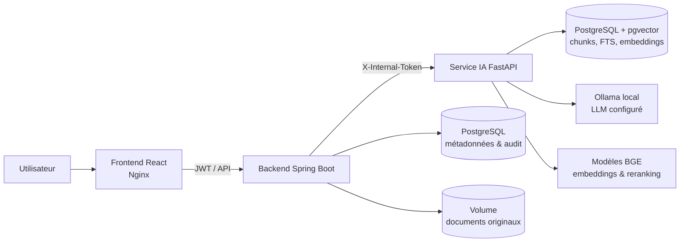
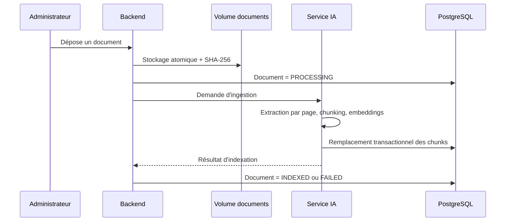
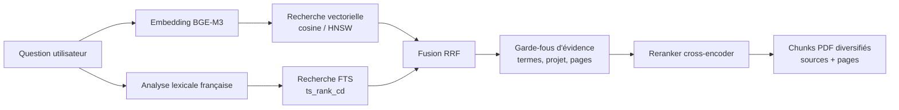
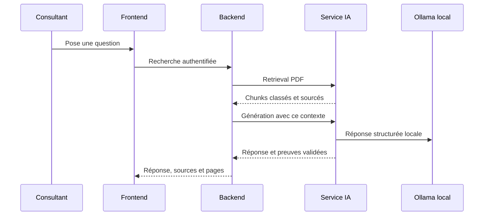
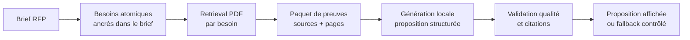
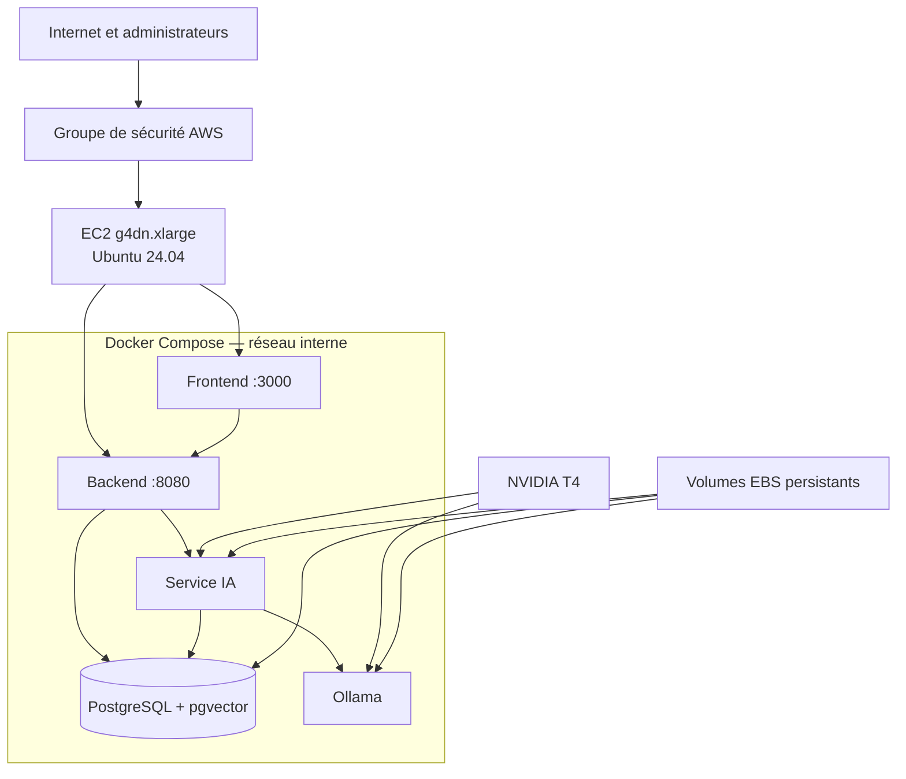

# Avaliance Copilot — Recherche documentaire et génération de propositions RAG souveraines

## Slide 1 — Le besoin métier : trouver une information fiable et produire plus vite

**Contenu visuel :**
- Un assistant documentaire pour les équipes Avaliance
- Deux parcours prioritaires : **recherche dans les documents PDF** et **génération de proposition RFP**
- Une réponse utile doit être liée à une source, une page et un extrait vérifiable
- Si le corpus ne contient pas de preuve suffisante, le système s’abstient

**Notes orateur :**
Avaliance Copilot ne cherche pas à être un chatbot généraliste. Son rôle est d’aider un consultant à exploiter une base documentaire interne : retrouver rapidement une information, comprendre son contexte et préparer une première proposition commerciale à partir d’un brief.

Le point central est la fiabilité. Une réponse n’est utile que si l’utilisateur peut vérifier d’où elle vient. La plateforme associe donc chaque réponse à des chunks de documents, à leur source et, pour les PDF, à leur page physique. Lorsqu’aucune preuve exploitable n’est trouvée, elle affiche une abstention explicite plutôt que de compléter avec une information non démontrée.

## Slide 2 — Une architecture souveraine, séparée par responsabilités

**Contenu visuel :**
- **React / TypeScript** : interface de recherche, consultation des sources et proposition RFP
- **Spring Boot** : API, authentification, rôles, orchestration des flux et audit
- **FastAPI** : ingestion, retrieval hybride, génération et contrôle des preuves
- **PostgreSQL + pgvector + Ollama local** : mémoire documentaire et modèles IA auto-hébergés

**Notes orateur :**
Le navigateur utilise le backend Spring Boot comme point d’entrée applicatif. Le backend applique les règles de sécurité, porte les rôles `ADMIN` et `CONSULTANT`, orchestre les appels IA et conserve une trace des opérations.

Le service FastAPI est dédié au RAG : il extrait les documents, calcule les embeddings, recherche les passages pertinents, produit une réponse et vérifie ses citations. PostgreSQL est à la fois la source de vérité applicative et le moteur de recherche : il stocke les documents, les chunks, les métadonnées, les index plein texte français et les vecteurs pgvector. La génération, les embeddings et le reranking sont exécutés localement : aucune API LLM externe n’est requise.

## Slide 3 — Du document source à une base de connaissances exploitable

**Contenu visuel :**
- Import administrateur : PDF, DOCX ou TXT, jusqu’à 20 Mo
- Cycle contrôlé : `STORED → PROCESSING → INDEXED` ou `FAILED`
- Extraction PDF par page ; rejet des fichiers sans texte exploitable
- Découpage en chunks contextualisés, embeddings BGE-M3 et indexation transactionnelle

**Notes orateur :**
L’administrateur reste maître du cycle documentaire. Le fichier original est conservé dans un volume dédié et le backend en calcule l’empreinte SHA-256. Il suit ensuite un statut clair, ce qui permet de savoir si le document est en traitement, indexé ou en erreur, et de le réindexer si nécessaire.

Pour les PDF, le service IA préserve les pages physiques grâce à une extraction structurée ; un repli est prévu pour les PDF textuels. Les documents vides, chiffrés ou scannés sans texte utile sont refusés afin d’éviter des citations artificielles. Le texte est découpé au niveau des phrases et paragraphes — cible d’environ 850 caractères, avec un recouvrement limité. Chaque chunk conserve son contenu, son document, sa page et ses métadonnées, puis reçoit un embedding de 1024 dimensions.

## Slide 4 — Comment fonctionne le RAG : retrieval hybride et preuves préservées

**Contenu visuel :**
- La question déclenche simultanément une recherche **sémantique** et une recherche **lexicale française**
- Les résultats sont fusionnés par **Reciprocal Rank Fusion (RRF)**, puis rerankés
- Les noms de projets, chiffres, passages lexicaux forts et pages voisines sont préservés
- La sélection finale fournit le contexte de génération et les citations visibles à l’utilisateur

**Notes orateur :**
Le RAG ne repose pas sur une seule recherche vectorielle. La branche sémantique comprend des formulations proches, même lorsque les mots diffèrent. La branche lexicale retrouve précisément des noms de projets, des acronymes, des chiffres ou des expressions attendues. Elles sont exécutées en parallèle, puis fusionnées selon la formule :

$$
\operatorname{RRF}(d) = \sum_i \frac{w_i}{k + \operatorname{rang}_i(d)}
$$

Un cross-encoder affine ensuite l’ordre des candidats. Des garde-fous empêchent qu’un passage important, bien identifié lexicalement, disparaisse après reranking. La sélection tient aussi compte des chunks voisins et des pages afin de conserver le contexte d’une phrase ou d’un tableau. La recherche utilisateur est volontairement limitée au scope `PDF` : les preuves affichées proviennent ainsi des documents administrés.

## Slide 5 — Parcours 1 : recherche documentaire sourcée et contrôlée

**Contenu visuel :**
- Écran **Recherche** : question libre et filtres optionnels (secteur, type, année, profondeur)
- Requête authentifiée au backend, qui orchestre le retrieval et la génération locale
- Réponse construite uniquement depuis les chunks PDF sélectionnés
- Restitution : réponse Markdown, score, document, page et extrait de chaque citation

**Notes orateur :**
Dans le parcours de recherche, le consultant pose une question en français et peut utiliser des filtres métier. Le frontend transmet la requête au backend authentifié ; le backend appelle ensuite le service IA pour rechercher les passages pertinents dans les documents PDF administrés.

La génération est strictement bornée à ce contexte. Le LLM local reçoit un catalogue de sources et doit fournir des citations structurées. Le service IA vérifie que chaque extrait cité appartient réellement au chunk déclaré, que le document et la page sont présents et que la preuve n’est pas ambiguë. L’utilisateur reçoit donc une réponse accompagnée des éléments nécessaires pour revenir au document source.

Si les sources sont absentes ou que les citations ne passent pas la validation, le système retourne le message d’abstention standard : « Information insuffisante dans le corpus pour répondre de manière fiable. » Le streaming de texte en direct n’est pas présenté comme une capacité produit : la priorité actuelle est la fiabilité du résultat et de ses preuves.

## Slide 6 — Parcours 2 : proposition RFP fondée sur le brief et les preuves PDF

**Contenu visuel :**
- L’utilisateur saisit un brief et peut préciser un secteur
- Le système extrait et normalise les besoins atomiques du brief
- Retrieval PDF jusqu’à trois preuves par besoin, puis génération de six sections
- Contrôles : citations, valeurs factuelles, couverture, longueur, répétitions et formulations génériques

**Notes orateur :**
Le parcours Proposition est distinct de la recherche simple. Il transforme d’abord le brief en exigences atomiques, puis recherche des preuves PDF adaptées à chacune d’elles. La proposition standard est structurée en six sections : synthèse exécutive, compréhension du besoin et objectifs, solution et périmètre, démarche et livrables, sécurité/risques/hypothèses/questions, puis fit Avaliance et prochaines étapes.

La génération n’est pas livrée sans contrôle. Le service vérifie notamment la validité des citations, la couverture des besoins, la cohérence des éléments factuels, la longueur et les répétitions. Si une proposition LLM ne respecte pas ces exigences, un fallback déterministe, ancré dans le brief, permet de produire une sortie maîtrisée plutôt qu’un texte générique non fiable.

## Slide 7 — Déploiement AWS : une plateforme GPU reproductible et sécurisée

**Contenu visuel :**
- Cible : **AWS EC2 `g4dn.xlarge`** sous Ubuntu 24.04 — 4 vCPU, 16 Go RAM et GPU NVIDIA Tesla T4
- Stockage : **150 Go EBS gp3** ; volumes persistants pour PostgreSQL, modèles Ollama, cache Hugging Face et documents originaux
- Runtime : Docker Compose + NVIDIA Container Toolkit ; GPU attribué à **Ollama** et au **service IA**
- Cinq conteneurs : frontend, backend, service IA, PostgreSQL/pgvector et Ollama

**Notes orateur :**
La cible de déploiement est une instance AWS EC2 `g4dn.xlarge` sous Ubuntu 24.04. Elle apporte quatre vCPU, 16 Go de mémoire et une carte NVIDIA Tesla T4. Le stockage recommandé est un volume EBS gp3 de 150 Go : il héberge les données PostgreSQL, les documents originaux, les modèles téléchargés par Ollama et le cache des modèles Hugging Face. Ces volumes rendent les redémarrages reproductibles sans devoir reconstruire l’ensemble de la connaissance ou retélécharger les modèles.

Sur l’instance, Docker Compose déploie la même topologie que celle utilisée en local : frontend React/Nginx, backend Spring Boot, service IA FastAPI, PostgreSQL 16 avec pgvector et Ollama. Le NVIDIA Container Toolkit expose la T4 aux conteneurs. Le fichier Compose attribue le GPU à Ollama pour l’inférence et au service IA pour les embeddings et le reranking CUDA/FP16. Sans ce runtime GPU, le service IA ne doit pas démarrer en mode production dégradé.

Le réseau Docker interne isole PostgreSQL, FastAPI et Ollama : ils ne doivent pas être publiés sur Internet. Seuls les points d’entrée nécessaires sont exposés — le frontend pour les utilisateurs et, si nécessaire, le backend pour l’exploitation. Le groupe de sécurité AWS limite SSH à l’adresse IP de l’administrateur et restreint les ports applicatifs au périmètre attendu.

Le déploiement suit une séquence contrôlée : préparer les secrets dans `.env`, valider la configuration Compose, démarrer PostgreSQL et Ollama, vérifier que le modèle configuré est chargé, puis démarrer la pile complète. Les health checks confirment successivement la base, le modèle, le service IA, le backend et le frontend. Enfin, la validation GPU se fait en situation réelle : `ollama ps` doit montrer le modèle en GPU, `nvidia-smi` doit montrer l’activité pendant l’inférence et le service IA doit confirmer que CUDA est disponible.
